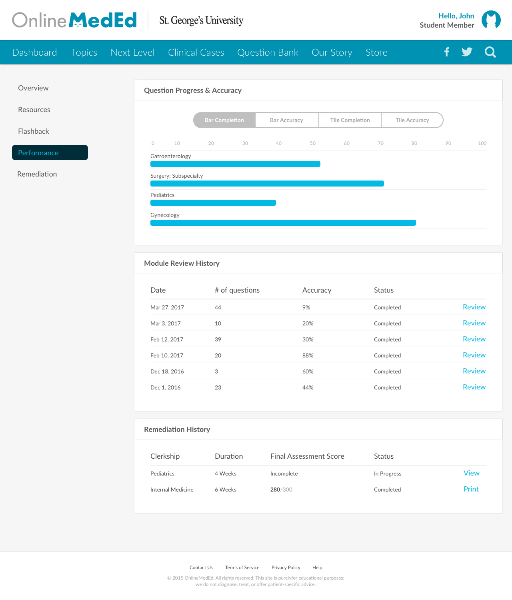

# OnlineMedEd Performance View
_Freelance work for OnlineMedEd - Performance View_

## Technologies
- HTML5
- SASS
- Twitter Bootstrap
- jQuery DataTables

## Functionality
1. The progress bars uses the Bootstrap Progress Bar component
2. The tabs within the “Question Progress & Accuracy” section use the Bootstrap Nav-
Tabs component. The progress percentages changes to reflect the data.
3. The tables in the “Module Review History” and “Remediation History” sections are sortable by column using the DataTables jQuery plugin.
4. The template is responsive. 

